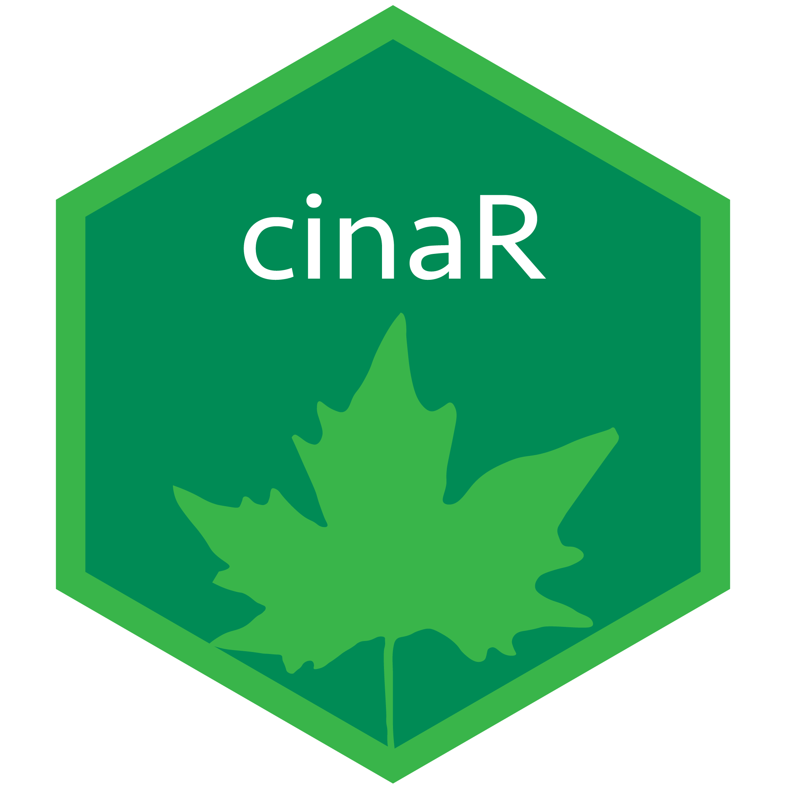

<!-- README.md is generated from README.Rmd. Please edit that file -->

# cinaR-genesets 

<!-- badges: start -->

<!-- badges: end -->

## Installation

    # install.packages("devtools")
    devtools::install_github("eonurk/cinaR-genesets")

## Usage

You can use these modules via setting `geneset` argument in
[cinaR](https://eonurk.github.io/cinaR/):

    library(cinaR)
    library(cinaRgenesets)

    data("VP2008")
    cinaR(..., geneset = vp2008)

## Available Genesets

This package contains 5 genesets curated from different sources.

#### Immune Modules

Immune system related modules from SLE patients published in [Nature
Communications (2020)](https://doi.org/10.1038/s41467-020-14396-9)

    data("VP2008")

#### PBMC scRNAseq Modules

Curated from PBMC scRNA-seq data (published via `cinaR`):

    data("PBMC.scRNAseq")

#### Wikipathways

These genesets are curated from
[wikipathways](https://www.wikipathways.org/index.php/WikiPathways):

    data("wiki")

#### Wikipathways Inflammation

Hand-picked subset of inflammation related pathways from
[wikipathways](https://www.wikipathways.org/index.php/WikiPathways):

    data("wiki.inf")

#### Dice Major Cell Types

Major cell types curated from [DICE](https://dice-database.org/)
database

    data("dice.major")

## Contribution

You can send pull requests to make your contributions.

## Author

-   [E Onur Karakaslar](https://eonurk.github.io/)

## License

-   GNU General Public License v3.0
